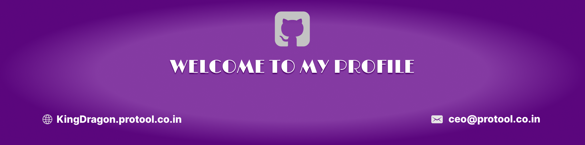

<!--Banner-->

<!--Night Owl image-->

  

<!--Header Name-->
#  ɪ'ᴍ KingDragon! 
*Digital Craftsman (Developer / Programmer)*
  

<!--Start Intro-->               

I’m a full-time AI & Full-Stack Developer with over 7 years of hands-on experience 
       building advanced systems that combine LLMs, automation, and modern web               
       technologies. My work bridges the gap between intelligent agents and beautiful, 
       functional user interfaces. From prompt design to production deployment, I build 
       systems that think, respond, and scale.

<!--End Intro-->

<!--Profile Count Badge-->

  

---

<!--Languages and Tools Section-->       
<h2 align="center">Tᴇᴄʜ sᴛᴀᴄᴋ & Lᴀᴛᴇsᴛ ʙʟᴏɢs</h2> 
<picture>
  <source media="(prefers-color-scheme: dark)" srcset="./Skills_Animation_Dark.gif">
  <source media="(prefers-color-scheme: light)" srcset="./Skills_Animation_White.gif">
  
</picture>
 

<h3 align="center">Recently provided</h3>
<ul align="left">
  
🧠 AI Agent & Automation Engineering

  <li>Prompt-Based LLM Apps using OpenAI & custom memory tools
  <li>AI Agent Logic with LangChain, task execution, and vector recall
  <li>Workflow Automation using n8n – for APIs, scraping, messaging, file routing
  <li>Chatbot Development integrated into support systems & frontend UIs
  <li>Image + Data Pipelines for content generation and task scheduling
</ul>
  
 
 
 

 
 

 

<!--Contribution Graph-->
<h2 align="center">📈 Cᴏɴᴛʀɪʙᴜᴛɪᴏɴ Gʀᴀᴘʜ 📈</h2>

    

---

<!--Dynamic Quote card updates everyday at 12 PM--> 
<h2 align="center">🌟 Tʜᴏᴜɢʜᴛ ᴏғ ᴛʜᴇ Dᴀʏ 🌟</h2>

<!--STARTS_HERE_QUOTE_CARD-->

    

<!--ENDS_HERE_QUOTE_CARD-->

<!--Contact Section--> 
<h2 align="center">🤝 Cᴏɴɴᴇᴄᴛ Wɪᴛʜ Mᴇ 🤝 </h2>

  

 

 

<!--Footer--> 

  

